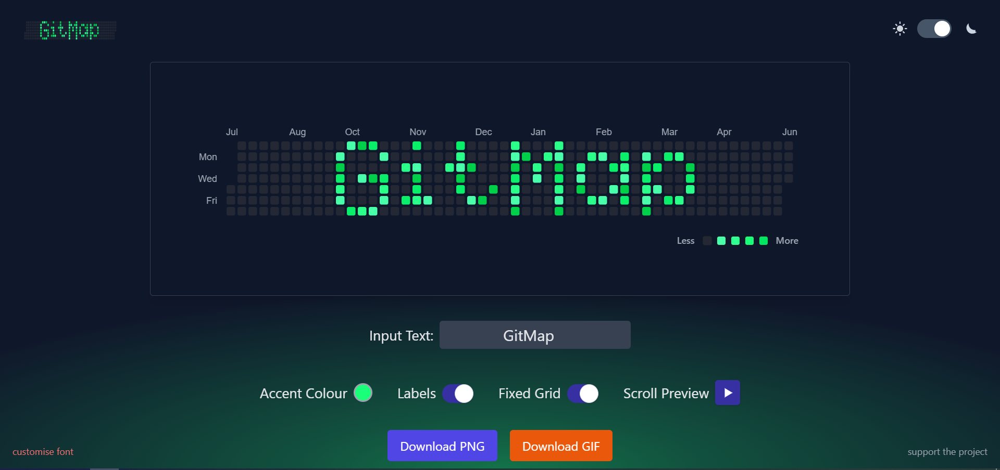
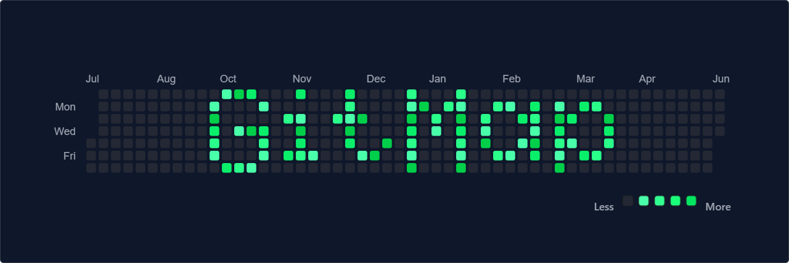
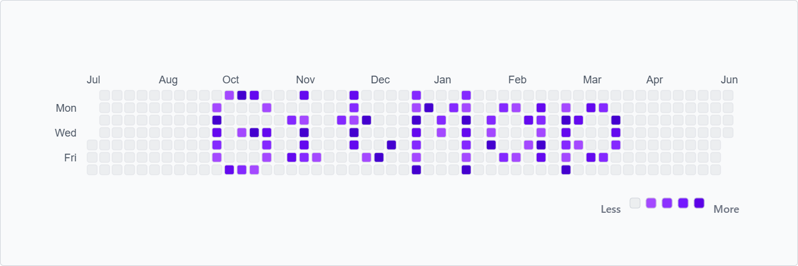
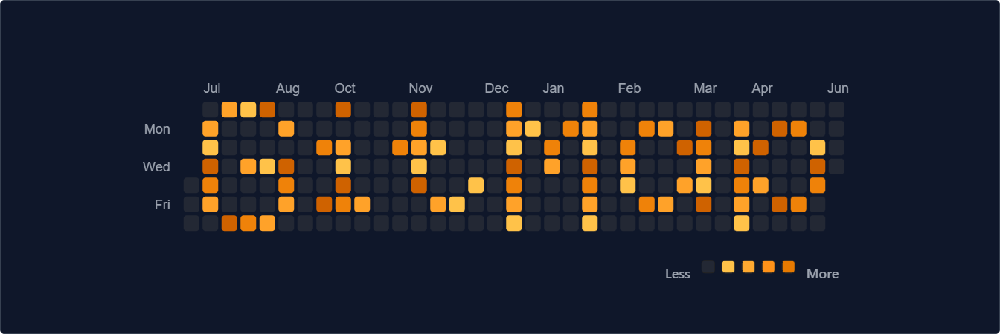
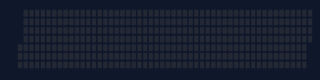
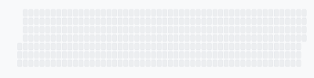

# GitMap - Text to Heatmap Generator



GitMap was just a fun project to level-up my frontend metle and make a banner for socials. It simply puts your text into a GitHub-style heatmap that you can download as a static PNG or an animated GIF.

## Live Demo

**[Try the GitMap Live Demo →](https://radiant-elf-80705a.netlify.app/)**

| Preview | Animation |
|---------|-----------|
| Fixed Grid w/ Labels (Dark) |  |
| Fixed Grid w/ Labels (Light) |  |
| Responsive Grid w/ Labels (Dark) |  |
| Responsive w/o Labels (Light) |  |
| GIF Export (Dark) |  |
| GIF Export (Light) |  |
| GIF Export w/ Custom Font (Dark) |  |


---

## Features

- **Text-to-Heatmap:** Dynamically converts your input text into a pixelated heatmap.
- **Dynamic Theming:** Switch between light and dark themes.
- **Font Customiser:** Design custom characters/fonts. 
- **Custom Accent Colour:** Set the accent colour of the heatmap with a colour picker.
- **Interactive Controls:**
    - Toggle month, day and legend labels.
    - Switch between a fixed 52-week grid and a responsive grid that fits the text.
    - Preview a scrolling animation of your text across the fixed grid.
- **Image Export:**
    - **Download as PNG:** Get a high-resolution static image of your heatmap.
    - **Download as GIF:** Export a smooth, animated scrolling GIF of your text (fixed grid only).


---

## Getting Started

To get a local copy up and running, follow these steps.

### Prerequisites

You'll need [Node.js](https://nodejs.org/) (version 16+) and [npm](https://www.npmjs.com/) installed on your machine.

### Installation

1.  **Clone this repo:**
    ```sh
    git clone https://github.com/blakedownward/github-textmap.git
    ```
2.  **Navigate to the project directory:**
    ```sh
    cd github-textmap
    ```
3.  **Install NPM packages:**
    ```sh
    npm install
    ```
4.  **Start the development server:**
    ```sh
    npm run dev
    ```

The application should now be running on `http://localhost:5173`.

---

## Contributing

Contributions, issues, and feature requests are welcome! Feel free to check the [issues page](https://github.com/blakedownward/github-textmap/issues).

1.  Fork the Project
2.  Create your Feature Branch (`git checkout -b feature/AmazingFeature`)
3.  Commit your Changes (`git commit -m 'Add some AmazingFeature'`)
4.  Push to the Branch (`git push origin feature/AmazingFeature`)
5.  Open a Pull Request

---

## Show your support

Give a ⭐️ if this project helped you!

[](https://www.buymeacoffee.com/blakeyvibes)
